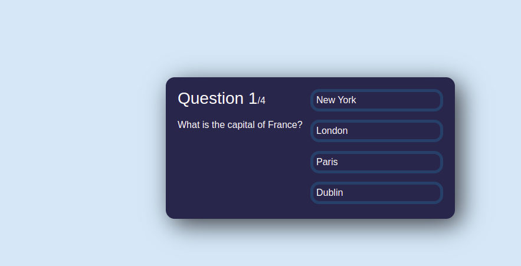

# QuizApp
Quiz app for students

Created using reactjs, Nextjs and React Native

## web:  reactjs

##app-web: Nextjs and Reactnative 👾 [Solito](https://example.solito.dev)
### 🔦 About

This monorepo is a blank(ish) starter for an Expo + Next.js app.

While it's pretty barebones, it does a lot of the annoying config for you. The folder structure is opinionated, based on my long experience building for this stack.

### 📦 Included packages

- `solito` for cross-platform navigation
- `moti` for animations
- `dripsy` for theming/design (you can bring your own, too)
- Expo SDK 46
- Next.js 12
- React Navigation 6

